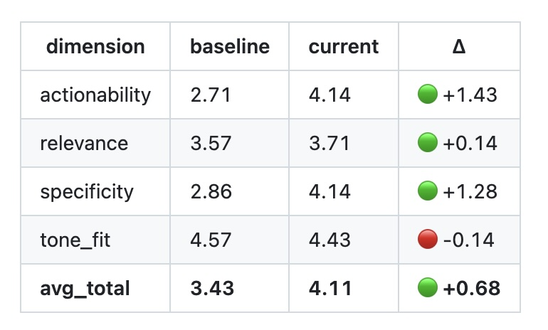

# claude-eval-kit

A lightweight LLM-as-judge framework for evaluating Claude responses with a pluggable rubric,
replay mode, and GitHub Actions integration.

[](https://github.com/domyozi/claude-eval-kit/actions/workflows/eval.yml)
[](LICENSE)

> **Why this exists**: LLM responses are probabilistic; eyeballing diffs doesn't tell you
> whether a prompt change actually improved quality. This kit lets you score
> `(user_input, ai_response)` pairs against a rubric, replay the same inputs against a
> new prompt, and **detect regressions automatically in CI**.

---

## In action

A live demo PR ([#1](https://github.com/domyozi/claude-eval-kit/pull/1)) adds two concreteness
rules to the default prompt. CI runs the eval, judges 7 fixed user inputs against the new prompt,
diffs against the committed baseline, and posts the result as a sticky PR comment:



| dimension     | baseline | current | Δ |
|---------------|----------|---------|---|
| actionability | 2.71     | 4.14    | 🟢 **+1.43** |
| specificity   | 2.86     | 4.14    | 🟢 **+1.28** |
| relevance     | 3.57     | 3.71    | 🟢 +0.14 |
| tone_fit      | 4.57     | 4.43    | 🔴 -0.14 |
| **avg_total** | **3.43** | **4.11** | 🟢 **+0.68 (+19.8%)** |

A 1-line prompt change → measurable quality improvement detected automatically on PR open.
That's the entire pitch of this kit.

---

## At a glance

```python
import asyncio
from claude_eval import (
    JudgePair, judge_pair, RUBRIC_COACH,
)

async def main():
    result = await judge_pair(
        JudgePair(
            user_input="今日は午前中、提案書を仕上げる。",
            ai_response="9-11時を集中ブロックに置きましょう。完了基準は2項目目までの章立て。",
        ),
        rubric=RUBRIC_COACH,
    )
    print(f"avg={result.total:.2f}")
    for s in result.scores:
        print(f"  {s.key}: {s.score} — {s.rationale}")

asyncio.run(main())
```

```
avg=4.50
  relevance: 5 — 「提案書を仕上げる」核心を捉えて時間帯を提示
  specificity: 4 — 時間枠あり、完了基準も2項目目までと数字
  actionability: 4 — 今日実行可能だが分解度はやや粗い
  tone_fit: 5 — 押し付けがましさなし、対等
```

---

## Design choices

### Rubric: 1/2/4/5 Likert (no 3)

The default scale excludes 3 to **prevent central-tendency bias**. Forcing the judge to
commit "leaning good or bad" surfaces more signal than a 1–5 scale where indifferent
responses cluster at 3.

```python
DEFAULT_SCORES = (1, 2, 4, 5)
```

### CoT-style judge output

The judge is required to emit `<observation>` (1–2 lines analyzing the pair) **before**
`<scores>` (the JSON rubric). This:
- Surfaces the judge's reasoning so each score is auditable
- Reduces "drive-by" scoring by forcing engagement with the content
- Lets you spot judge bias from the rationale

### No LangChain dependency

Direct Anthropic SDK calls only. This keeps the runtime minimal (one dependency),
the code path debuggable, and avoids version-skew issues. If you need orchestration,
wrap this kit; don't fork it.

### Pluggable prompt builder for replay

The replay mode accepts a `PromptBuilder` protocol so you can plug in your production
prompt assembly. Example:

```python
from claude_eval.replay import replay_and_pair

def my_prompt_builder(entry):
    # entry is a dict from your fixture
    system = my_app.build_system_prompt(user_id=entry.get("user_id"))
    user = entry["user_input"]
    return system, user

pairs = await replay_and_pair(
    fixture_entries, prompt_builder=my_prompt_builder
)
```

---

## Architecture

```
                    ┌────────────────────┐
                    │  fixture JSON      │
                    │  fixed user_inputs │
                    └─────────┬──────────┘
                              │
                       (replay mode)
                              ▼
            ┌─────────────────────────────────┐
            │  PromptBuilder (pluggable)      │
            │  entry → (system, user)         │
            └─────────────────┬───────────────┘
                              │
                              ▼
            ┌─────────────────────────────────┐
            │  Anthropic SDK — fresh response │
            └─────────────────┬───────────────┘
                              │
                              ▼
            ┌─────────────────────────────────┐
            │  LLM-as-judge                   │
            │  rubric → 1/2/4/5 per dim       │
            │  <observation> → <scores>       │
            └─────────────────┬───────────────┘
                              │
                              ▼
                  ┌───────────┴───────────┐
                  ▼                       ▼
         ┌────────────────┐    ┌────────────────────┐
         │ markdown report│    │ baseline.json diff │
         │ + worst N      │    │ → CI fail on drop  │
         └────────────────┘    └────────────────────┘
```

---

## Install

```bash
pip install -e ".[dev]"     # editable + dev deps (pytest, ruff)
```

Set `ANTHROPIC_API_KEY` in your environment or `.env`:

```bash
export ANTHROPIC_API_KEY=sk-ant-...
```

---

## CLI

```bash
# One-shot eval against the bundled fixture
python -m claude_eval.cli \
  --fixture fixtures/sample_pairs.json \
  --label "exploratory"

# Diff against a stored baseline (CI use case)
python -m claude_eval.cli \
  --fixture fixtures/sample_pairs.json \
  --label "pr-current" \
  --baseline fixtures/baseline.json \
  --fail-threshold 0.3 \
  --out /tmp/report.md \
  --json-out /tmp/scores.json

# Snapshot the current scores as the new baseline
# (run on main after a prompt PR has merged)
python -m claude_eval.cli \
  --fixture fixtures/sample_pairs.json \
  --update-baseline fixtures/baseline.json
```

Cost: 1 pair ≈ $0.003 on Claude Haiku for both replay + judge. The bundled 7-pair fixture
costs roughly $0.04 per full run.

---

## GitHub Actions

Drop `.github/workflows/eval.yml` (included) into your repo. On every PR that touches
`src/claude_eval/**` or `fixtures/**`, the workflow:

1. Installs the package
2. Runs unit tests
3. Replays the fixture against the **current code** prompt
4. Diffs against `fixtures/baseline.json`
5. Posts the report as a sticky PR comment
6. Fails the workflow if any dimension drops by ≥ `--fail-threshold` (default 0.3)

A typical PR comment:

```markdown
# Eval — pr-42
- avg total: 4.10 / 5

## Baseline vs Current
| dimension | baseline | current | Δ |
|---|---|---|---|
| relevance     | 3.20 | 3.50 | 🟢 +0.30 |
| specificity   | 3.60 | 4.30 | 🟢 +0.70 |
| actionability | 3.40 | 3.50 | 🟢 +0.10 |
| tone_fit      | 5.00 | 4.80 | ⚪ -0.20 |
| **avg_total** | 3.80 | 4.10 | 🟢 +0.30 |
```

Required: a `ANTHROPIC_API_KEY` repo secret.

---

## Case study: BusyBoy2 AI coach

The kit was extracted from a real production app where an AI coach generates
journal-style feedback. **Result:** a single 1-line prompt change improved
average quality from 3.95 → 4.32 (+9.4%), driven by a +1.17 jump in the
`specificity` dimension. The improvement was **detected and quantified by this kit**;
without it, the change would have been "feels a bit better" hearsay.

See [`examples/busyboy_case_study/README.md`](examples/busyboy_case_study/README.md)
for the full write-up: rubric tuning, defense-in-depth guards built from worst-example
analysis, and CI integration.

---

## Customizing the rubric

```python
from claude_eval import Rubric, RubricDimension

my_rubric = Rubric(
    dimensions=(
        RubricDimension(
            key="factuality",
            label="事実性",
            description="応答の事実情報が検証可能か。誤りの有無を見る。",
            anchors={
                5: "全て事実",
                4: "概ね事実、軽微な不確かさ",
                2: "重要な誤りあり",
                1: "ほぼ全て誤り",
            },
        ),
        # ... 1+ more dimensions
    )
)
```

Then pass it to `judge_pair(..., rubric=my_rubric)` and `summarize(..., rubric=my_rubric)`.

The bundled `RUBRIC_COACH` (relevance / specificity / actionability / tone_fit) targets
coach-style assistants but is a usable starting point for general-purpose evaluation.

---

## What this is not

- **Not a production observability tool.** For real-time monitoring of LLM apps, look at
  Langfuse, Helicone, or Arize.
- **Not an alignment-quality benchmark.** The rubric here measures *response quality*
  for a specific style (coach). For safety/factuality at scale, use HELM / OpenAI evals
  with thousands of samples.
- **Not human-eval-calibrated.** The judge model is itself an LLM with biases. For
  high-stakes decisions, treat the score as a screening signal and add human review.

---

## Limitations

- **Judge bias**: same-family judges (e.g., Claude judging Claude) tend toward fawning.
  Cross-model judging (Sonnet + Haiku ensemble) is more robust but ~3× the cost.
- **Small sample size**: 7-pair fixtures give noisy signal. 50–100 is more stable.
- **Replay assumes deterministic prompt assembly**: if your prompt depends on live
  user state, the replay mode needs a `PromptBuilder` that captures that state at fixture time.
- **Fault tolerance**: judge JSON parse failures are skipped, not retried. Tune `--fail-threshold`
  to be lenient when sample size is small.

---

## License

MIT — see [LICENSE](LICENSE).

---

## Acknowledgments

Built while shipping an AI coaching feature; the eval problem was real, not academic.
Designed for clarity over completeness — the entire framework is < 500 lines of code,
deliberately so.
